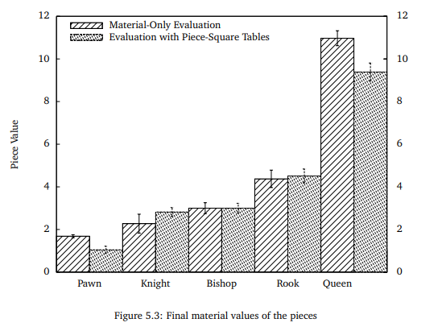

﷽

<h1>Fonctions d'Estimation pour le Jeu d'Echecs</h1>

Travail fait par  **CHEBBAH Mehdi** et **HAMMAS Ali Cherif**

# Introduction

Tous les programmes d'échecs passés et présents sont inspirés d'un papier publié par **Claude Shannon** intitulé *'Programming a Computer for Playing Chess'* . Shannon présente sa stratégie de type **MINMAX** basée sur des fonctions d'évaluations. Il met en avant deux types de recherches des coups à jouer (type A et type B) et constate l'impossibilité d'utiliser une recherche par **force brute** (Type A), notamment à cause de la capacité de calcul limitée des ordinateurs de l'époque. La recherche de type B, à la manière d'un humain, se concentre sur les positions et coups les plus prometteurs.

Dans son article, Shannon, soulève l'impossibilité de calculer toutes les positions et coups possibles. Il calcule un nombre de coups potentiels ayant un sens durant une partie.

Shannon expose son processus basé sur la **fonction d'évaluation** statique de la position donnée d'une **pièce d'échecs**, pour permettre à l'ordinateur de décider du coup à jouer.

La communauté ensuite constate que donner des poids statique aux pièces d’échecs n’était pas une méthode puissante pour décider. Pour cela plusieurs recherches ont était mises en place dont le but est d'inventer une fonction d'estimation qui est proche de la réalité. Dans ce qui suit on va essayer d’implémenter notre fonction.

# Les Fonctions D'estimation

Notre vision était d'essayer d'appliquer les méthodes du **Machine Learning** dans la construction d'une fonction d'estimation qui peut être utiliser dans les moteurs de jeux d’échecs et qui peut être par la suite être améliorer en utilisant les données issues des matches joués dans ces dernier (améliorer la précision du modèle par exemple).

Pour faire on a suivie la méthodologie suivante:

**1. Collection des données:**

>   Pour cette tache on a décider d'utiliser une collection des parties de jeux d’échecs publiée dans le site web **[kaggle](https://www.kaggle.com)** sous le titre **[3.5 Million Chess Games](https://www.kaggle.com/milesh1/35-million-chess-games)** publié le 06/08/2018 par [Miles](https://www.kaggle.com/milesh1). Cette **Data Set** contient les données de plus de 3.5 million de jeux d’échecs depuis 1783 écrits sous le format  **Algebraic**.

**2. Data Cleaning:** 

>   Pour pouvoir utiliser les données qui se trouve dans la Data Set on besoin d'un Nettoyage des données. C'est a dire:
>
>   +   Enlever les parties non terminées.
>   +   Enlever les champs non utilisées.
>   +   Transformer les parties dans le format utiliser par le programme.
>   +   Classifier les parties en gagné par le noir et gagné par le blanc.
>
>   Pour accomplir cette tache on a écrit un programme `python` en appuyant sur un open source `chess engine` appelé `python-chess` qui ce trouve dans Github [ici](https://github.com/niklasf/python-chess).

**3. Construction du *modèle*:**

>   Cette tache dépend de l’implémentation et de la fonction d'estimation choisie.

**4. Utilisation du modèle :**

>Après la construction du modèle on va exporter les résultats (les valeurs des nœuds du réseaux de neurones) dans un fichier externe, puis dans l’implémentation de la fonction on va importer ce fichier et reconstruire le réseaux de neurones et l'utiliser pour essayer de prédire le résultats de l’évaluation.

Les fonctions implémentés:

## I. `Neural Network Classification`

### L'intention 

Comme mentionné dans [l'article](https://www.researchgate.net/publication/322539902_Learning_to_Evaluate_Chess_Positions_with_Deep_Neural_Networks_and_Limited_Lookahead) publié par *Matthia Sabatelli* dans [researchgate](https://www.researchgate.net/), l'utilisation de la classification pour résoudre le problème de l’évaluation d'une configuration donnée de jeu d’échecs  peut donner des résultats prometteurs.

Cette fonction d'estimation est basé sur un modèle de classification qui pour une configuration donné essaye de prédire si le joueur gagne le matche ou pas (soit 100 ou -100).

Le modèle est construit a base des réseaux de nuerons a cause de la masse énorme des donnees.

### L’implémentation

L’implémentation de cette fonction est réalisée en utilisant une bibliothèque Open source appelé **[Genann](https://github.com/codeplea/genann)** utilisé pour la manipulation des *feedforward artificial neural networks (ANN)* dans le langage C.

Pour la phase d’apprentissage on a utilisé les données classifie issue de la phase *Data Cleaning*.

Les paramètres du modèle sont les suivantes:

+   **taille du réseaux de nuerons:** 768\*60\*60\*1
+   **Input**: la linéarisation d'une configuration du jeu selon le type de pièce (64*8 =  768 bytes)
+   **Output**: gagne/Perdre (100/-100)

### Pros & Cons

| Avantages | Inconvénients                                                |
| :-------- | :----------------------------------------------------------- |
|           | + Cette méthode ne donne pas une estimation mais une classification. + Ne peut pas être utilisé comme une fonctions d'estimation. + Les résultats sont loin de la réalité. + Elle est très lente. |

## II. `Neural Network Regression`

### L'intention

Pour contourner les problèmes de la première solution on a essayer d'utiliser un modèle de régression pour que les résultats du modèle soient la probabilité que le joueur gagne en se basant sur la configuration au lieu de donner une classification basé sur cette dernière.

Aussi on a décider d’utiliser les réseaux de nuerons aux lieu d'un simple modèle de régression linéaire a cause de la quantité massive des donnees (6GB) qui ne peuvent pas être traitées par un simple modèle de régression.

### L'implémentation

Pour l’implémentation de cette solution on a utilisé une bibliothèque Open source pour la manipulation des réseaux de nuerons en C appelé ***[FANN](http://leenissen.dk/fann/wp/)*** (Fast Artificial Neural Network). 

#### 1. Basé sur la classification du `DataSet`

Pour améliorer la précision on a essayer d'utiliser seulement les configurations après les 30 premiers mouvements de la data Set classifiée, on a remarqué une petite amélioration.

Les paramètres du modèle sont les suivantes:

+   **taille du réseaux de nuerons:** 
    +   64\*20\*1 
    +   64\*50\*40\*30\*20\*20\*1
+   **Input**: la linéarisation d'une configuration du jeu (64  bytes)
+   **Output**: gagne/Perdre (100/-100)

#### 2. Basé sur l'estimation de `Estim6`

Pour la phase d'apprentissage on a utilisé les configurations après les 30 premiers mouvement de la data Set avec comme valeurs d'estimation les valeurs de la fonction `Estim6`.

Les paramètres du modèle sont les suivantes:

+   **taille du réseaux de nuerons:** 64\*30\*1
+   **Input**: la linéarisation d'une configuration du jeu (64  bytes)
+   **Output**: Une estimation entre -100 et 100 représente la probabilité que le joueur gagne.

#### 3. Basé sur l'estimation de `StockFish`

Pour augmenter le niveau  de  la fonction d'estimation on a décidé d'utiliser une fonction d'estimation plus puissante que la fonction `Estim6` par exemple la fonction d'estimation qui se trouve dans le moteur de jeu d’échecs Open source `StockFish`. Nous avons remarqué une grande amélioration dans les performances du jeu.

Les paramètres du modèle sont les suivantes:

+   **taille du réseaux de nuerons:** 64\*30\*1
+   **Input**: la linéarisation d'une configuration du jeu (64  bytes)
+   **Output**: Une estimation entre -100 et 100 représente la probabilité que le joueur gagne.

### Pros & Cons

| Avantages                                                    | Inconvénients                                                |
| :----------------------------------------------------------- | :----------------------------------------------------------- |
| + La précision du modèle peut être améliorer. + Une bonne stratégie dans la fin de jeu. | - Le bot qui utilise cette estimation n'a pas de stratégie dans le début de la partie. - Lente par rapport aux estimations statiques. |

## III. `Square-piece values`

### L'intention 

Cette fonction diffère des autres car elle n'utilise pas le *Machine Learning* mais elle essaye d’améliorer la solution qui donne des valeurs statiques aux pièces. l’amélioration proposée par cette méthode est de donner une valeur qui dépend et de la pièce choisie et de la position de la pièce.

Cette amélioration est due au fait qu'une pièce dans le tableau de bord d'échecs ne peut pas avoir de valeur indépendamment de sa position, par exemple la valeur d'un pion dans sa position initiale n'est pas la même que sa valeur dans la ligne avant la dernière. la valeur d'une pièce dépend également du fait que nous sommes au début, au milieu ou à la fin du jeu.

Pour des raisons de simplicité de la fonction d'estimation on a décidé d'utiliser seulement des valeurs relatives a la position des pièces (ne dépend pas de l’état d'avancement de jeu).

### L’implémentation

Pour l’implémentation de cette solution on a utilise les tableaux de valeurs des pièces mentionnés dans la feuille de recherche de *Sacha Droste* et *Johannes Fürnkranz* publiée en 2008 qui définie des valeurs des pièces de jeu d’échecs en fonction de la position de la pièce. 

Dans cette recherche Droste et Fürnkranz utilisait le *Reinforcement Learning* pour définir les valeurs des pièces. Ici ce sont les résultats obtenues:

### Pros & Cons

| Avantages                                         | Inconvénients                                                |
| :------------------------------------------------ | :----------------------------------------------------------- |
| + Une bonne stratégie dans le début de la partie. | - Il est difficile d'estimer des bonnes valeurs pour pièces surtout dans la fin de la partie. - Manque d'une stratégie pour la fin du jeu. |

## IV. `L'attaque est la meilleure défense`

### L'intention

Pour cette fonction on a essayé d'utiliser plusieurs stratégie au même temps. Dans le début de la partie on utilise la  méthode des tables pour bien positionner les pièces dans des endroits stratégiques dans l'échiquier. Puis favoriser l'attaque sur la défense pour rendre l'autre joueur joue en mode défense ce qui donnera au bot le contrôle du jeu.

### L’implémentation

On va découper la partie de jeu en deux sous parties, la première s'occupera de la position des pièces en utilisant `Estim11` et la deuxième se focalisera sur l'attaque `Estim4`. Pour cela on va adopter la première stratégie tant que le nombre de pièces restantes du coté du joueur qui utilise cette fonction est supérieur a 10, si ce nombre  décroît plus que cela on adoptera la deuxième stratégie pour placer plus de pression. Bien sur les évaluations données par ces deux stratégies seront rajoutées aux évaluations déjà calculées   concernant le nombre de pièces et leurs poids.

### Pros & Cons

| Avantages                                                    | Inconvénients |
| :----------------------------------------------------------- | :------------ |
| + Une bonne stratégie au début de jeu. + Une bonne stratégie a la fin de jeu. | - Compliqué   |

# Les résultats

Pour cette section nous nous sommes concentrer sur la meilleur façon avec laquelle on pourrait faire une comparaison signifiante entre les nouvelles fonctions d’estimations établies et même avec ceux déjà implémentées aux préalable, pour ce faire nous avons décidé que la meilleur façon de comparer entre eux était de comparer entre leur efficacité vu que leur performances étaient similaires par tout et que le temps d’exécution était presque le même, donc dans nous avons établi une sorte de compétitions entre les différentes fonctions d’évaluation que nous avons implémentées.

chaque fonction va se mesurer à toutes les autres fonctions en faisant 10 matches pour chacune d’elles avec les autres fonction et en changeant a chaque fois les paramètres du matches (la profondeur de l’arbre et nombre d’alternatives maximal) puis on calculera le nombre de matches gagnés et perdus, tout cela sera présenté sous forme de tableau pour une meilleur visibilité et compréhension.

|         |  E1  |  E2  |  E3  |  E4  |  E5  |  E6  |  E7  |  E8  |  E9  | E10  | E11  | E12  | parties gagnées |
| :-----: | :--: | :--: | :--: | :--: | :--: | :--: | :--: | :--: | :--: | :--: | :--: | :--: | :-------------: |
| **E7**  |  2   |  1   |  0   |  0   |  0   |  0   |  /   |  0   |  1   |  0   |  0   |  0   |     **3%**      |
| **E8**  |  2   |  1   |  0   |  0   |  1   |  0   |  10  |  /   |  6   |  3   |  1   |  0   |    **21.8%**    |
| **E9**  |  1   |  1   |  0   |  0   |  0   |  0   |  9   |  4   |  /   |  2   |  1   |  0   |   **15.45%**    |
| **E10** |  4   |  2   |  1   |  0   |  0   |  1   |  10  |  7   |  8   |  /   |  2   |  0   |    **31.8%**    |
| **E11** |  5   |  3   |  2   |  1   |  2   |  2   |  10  |  9   |  9   |  1   |  /   |  2   |    **41.8%**    |
| **E12** |  8   |  6   |  7   |  6   |  5   |  5   |  10  |  10  |  10  |  10  |  8   |  /   |   **77.27%**    |

Lors de l’exécution des tests nous avons vu clairement que la fonction `Estim7` (la classification) était très lente par rapport aux autres fonctions d’estimation à cause du fait que cette fonction utilisait un réseau de neurones qui avait comme 768 entrées donc beaucoup de temps était perdu lors de l’initialisation et du remplissage du tableau sans oublier les calcules qui se font à l’intérieur du réseau de neurones.

Pour les fonctions `Estim8`,`Estim9` et `Estim10` les résultats étaient plus au moins semblables et il s’est avéré que l’utilisation de cette méthode ne donne pas de très bons résultats.

Un petit changement s’est fait remarquer après l’introduction de la fonction `Estim11` qui utilise les tableaux de positions statiques, surtout en choisissant des paramètres de petites valeurs, grâce a ces tableaux les pièces vont êtres placées dans les meilleurs endroits possibles se qui rend la tâche plus facile après néanmoins, après un bon positionnement cette fonction ne préoccupe pas des autres facteurs (l’attaque, la défense, la protection du roi ...) et par conséquent l’efficacité va se réduire énormément au milieu et à la fin de la partie.

Il est à constater que l’efficacité de la fonction `Estim12` ,qui se base sur les tableaux de positions statiques au début de la partie pour bien se positionner puis se concentrer sur l’attaque pour le reste de la partie, se manifeste clairement lorsqu’on utilise des paramètres grands (profondeurs et nombre d’alternatives), pour les petites valeurs les résultats sont souvent semblables entre cette dernière et les autres fonctions.

# Conclusion

Nous pensons que cette petite recherche fournit des informations solides sur l'utilisation de l'apprentissage automatique dans les échecs. Ses principales contributions peuvent être résumées comme suit:
Premièrement, nous proposons des nouveaux méthodes qui visent à former des ANNs pour l'évaluation des échiquiers de la même manière que les joueurs hautement qualifiés le font. 

Notre méthode se concentre beaucoup plus sur la découverte des patrons relatives aux positions des pièces d'échecs dans un échiquier. 

Même si les meilleurs résultats n'ont pas été obtenus grâce à l'apprentissage automatique, nous pensons que les performances des ANNs peuvent être améliorées en jouant sur les paramètres des ANNs et la tailles et la qualité des données. Pour les travaux futurs, nous voulons alimenter les architectures ANN avec des images plus informatives sur les positions des échecs et voir si l'écart entre les fonctions basées sur les ANNs et les fonctions classique qui n'utilisent pas l'apprentissage automatique peut être réduit.

Nous pensons que cette stratégie, associée de manière appropriée à un algorithme de recherche, permettra à l'ANN de surpasser les joueurs humains les plus forts, même sans avoir à s'appuyer sur des algorithmes de recherche approfondie.

# Bibliographie & Webographie

1.  (en) I. James, « Claude Elwood Shannon 30 April 1916 -- 24 February 2001 », *Biographical Memoirs of Fellows of the Royal Society*, vol. 55,‎ 2009, p. 257–265.
2.  (en) [Documentation for the *chess dataset*](https://chess-research-project.readthedocs.io/en/latest/)
3.  (en) [python-chess: a pure Python chess library](https://python-chess.readthedocs.io/en/latest/)
4.  (en) [Using neural networks instead of regression?](https://www.researchgate.net/post/using_neural_networks_instead_of_regression)
5.  (en) [Fast Artificial Neural Network Library](http://leenissen.dk/fann/wp/)
6.  (en) *Learning of Piece Values for Chess Variants.* Technical Report TUD–KE–2008-07, Knowledge Engineering Group, [TU Darmstadt](https://www.chessprogramming.org/Darmstadt_University_of_Technology), [pdf](http://www.ke.tu-darmstadt.de/publications/reports/tud-ke-2008-07.pdf)
7.  (en) *Learning to Evaluate Chess Positions with Deep Neural Networks and Limited Lookahead*, Matthia Sabatelli , Francesco Bidoia , Valeriu Codreanu and Marco Wiering2, [pdf](https://www.ai.rug.nl/~mwiering/GROUP/ARTICLES/ICPRAM_CHESS_DNN_2018.pdf)
8.  (en) Stockfish 11, [Stockfish](https://stockfishchess.org)
